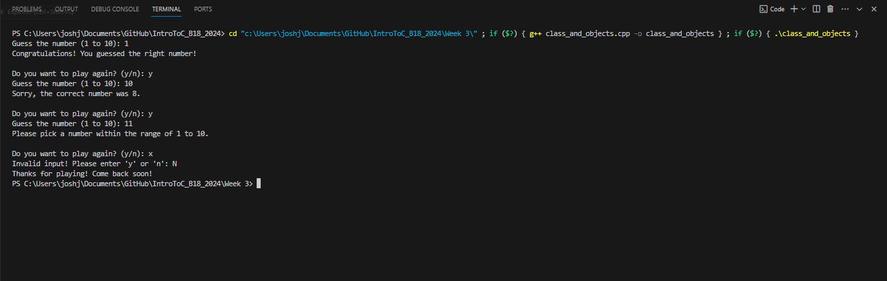

## Unit 3 Assignment 1 - Classes and Objects : C++ Number Guessing Game Part 2

This simple C++ program is a number guessing game where the player has to guess a random number between 1 and 10. It contains at least one class, one object, and one function.

Class: Game class manages game logic, including random number generation, user prompts, and feedback.

Object: Game object created, named guessGame, manages game state and interactions with the player

Function: The playGame() function in the Game class runs the game. It includes the game loop, player input, feedback, and game restart logic if the player chooses.

C++ Number Guessing Game Code while Running: 

