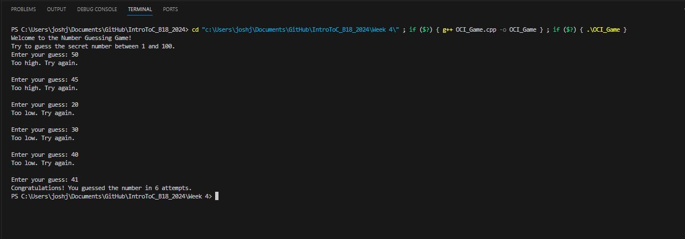

Unit 4 Assignment 1 - Objects, Classes, and Inheritance: C++ Number Guessing Game Part 3

This simple C++ program is a number guessing game where the player has to guess a random number between 1 and 100. It contains at least one object, class, and inheritance

- Objects: The object is created in the main() function using NumberGuessingGame game;
- Classes: The Game and NumberGuessingGame classes are defined
- Inheritance: The NumberGuessingGame class inherits from the Game class using the public access specifier (class NumberGuessingGame : public Game)

C++ Number Guessing Game Code while Running: 

