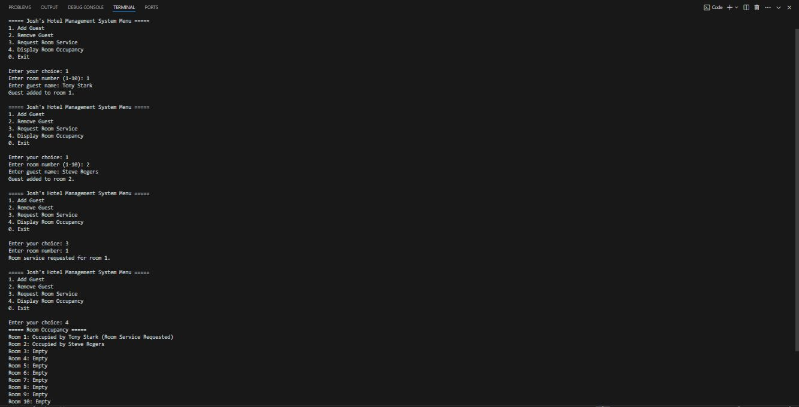
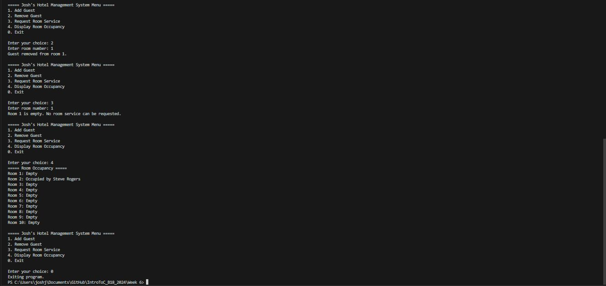

## Unit 6 Assignment 2 - Project Completion

The hotel management system program was introduced with basic functionalities allowing users to add and remove guests from hotel rooms. In the updated and complete version of the program, new features such as the ability to request room service and display room occupancy were added, providing users with a more comprehensive tool for managing hotel operations and improving guest experience.

• Adding 2 Guests, Requesting Room Service, and Displaying Current Occupancy Status: 

• Removing a Guest, Requesting Room Service to Empty Room, Displaying Updated Occupancy Status: 

